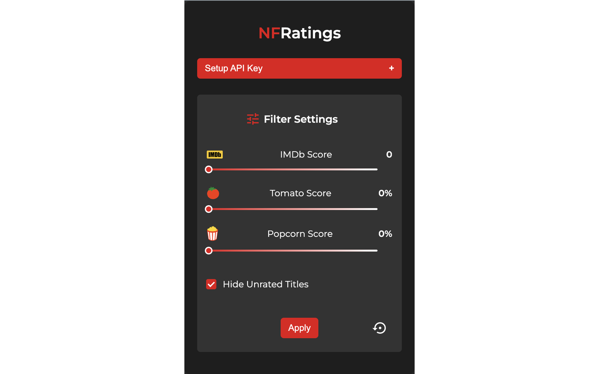
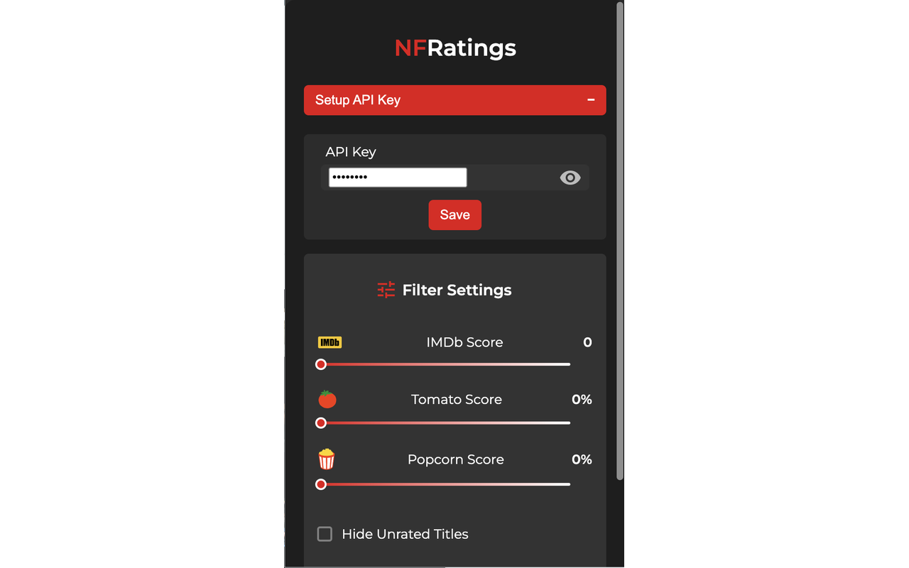

# <span style="color:#e50914">NF</span>Ratings Chrome Extension


NFRatings enhances your Netflix experience by integrating IMDb, Rotten Tomatoes Critics & User ratings directly on Netflix thumbnails.

##  Chrome Extension

Install the Chrome Extension publishded to Chrome Web Store [here]().

## Features

- **IMDb Ratings:** View  ratings for each title.
- **Rotten Tomatoes Scores:** AccViewess Tomatometer  and Audience Score .
- **Customizable Filters &#xe429;:** Set minimum rating thresholds to filter out low-rated content.

## Screenshots

### Ratings Applied


### Filters Applied


### Popup Filter Settings



### Popup ApiKey Settings



## Getting the OMDb API Access Key

1. Go to <https://www.omdbapi.com/apikey.aspx> and fill in the details.
2. Create the Access Key and copy it from the email reply.
3. Save it from the popup window for the Extension in Chrome Browser.

## Developer Setup

### 1. Clone the Repository

```sh
git clone https://github.com/yourusername/nfratings.git
cd nfratings
```

### 2. Install Dependencies

```sh
npm install
```

### 3. Build the Extension

```sh
npm run build
```

Debug:

```sh
npm run watch
```

### 4. Load the Extension in Chrome

- Open [chrome://extensions/](chrome://extensions/) tab
- Enable "Developer Mode"
- Click "Load unpacked" and select the build directory
- Click "Update" to load any changes to code in the directory

## License

This project is licensed under the MIT License. See the [LICENSE](./LICENSE) file for details.
